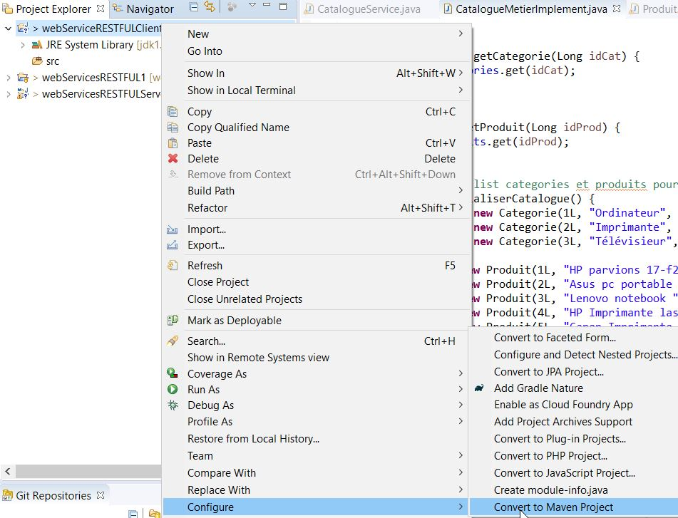
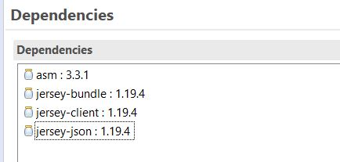
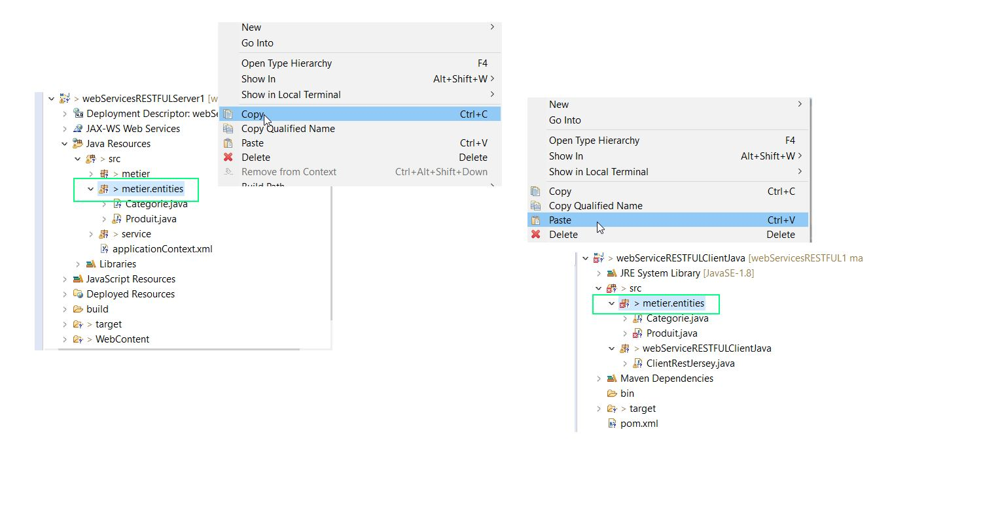

# Jersey Client Java 

[Autre exemple avec Jax-rs implementation](https://www.baeldung.com/jersey-jax-rs-client)


## Creation projet java et le convertir en projet maven


## ajouter les dependances jar dans pom.xml




## copier les entités sur le client jersey.

Copier les entities **Categorie** et **Produit** depuis le serveur vers le Client. **Si c'est un autre language de programme il faudra alors creer ces entités. Comme ici c'est un client java il suffit de les copier depuis le server


##  Application main

- La premiere opération effectue un **GET** sur tous les categories.
- La seconde opération effectue un **POST** sur une categorie. Ici nous fournissons une chaines de caractère. mapping Strig
- La Troisieme opération effectue un **POST** sur une catégorie mais cette fois ci on fourni à la methode Post un **object Categorie**. Mapping Object. **Peferer le mapper d'Object qu'au lieu de fournir un chaine String pour les methodes POST**


- **.accept(MediaType.APPLICATION_JSON)**: Accepte de recevoir la réponse sous forme de données json.
- **.type(MediaType.APPLICATION_JSON)**: Renvoi les données sous forme de données json vers le server.

L'Object **ObjectMapper** permet de **serialiser** ou de **désérialiser** un objet.

```java
package webServiceRESTFULClientJava;

import java.io.IOException;
import java.net.URI;
import java.util.Map;
import java.util.Set;

import javax.ws.rs.core.MediaType;
import javax.ws.rs.core.UriBuilder;

import org.codehaus.jackson.JsonParseException;
import org.codehaus.jackson.map.JsonMappingException;
import org.codehaus.jackson.map.ObjectMapper;

import com.sun.jersey.api.client.Client;
import com.sun.jersey.api.client.ClientResponse;
import com.sun.jersey.api.client.config.ClientConfig;
import com.sun.jersey.api.client.config.DefaultClientConfig;

import metier.entities.Categorie;

public class ClientRestJersey {

	static String urlRest = "http://localhost:8080/webServicesRESTFULServer1/";

	public static void main(String[] args) throws JsonParseException, JsonMappingException, IOException {

		Client client = Client.create(new DefaultClientConfig());
		URI uri = UriBuilder.fromUri(urlRest).build();

		// Consulter toutes les categories
		// GET http://localhost:8080/webServicesRESTFULServer1/catalogue/categories
		ClientResponse consultCategorieResponse = client.resource(uri).path("catalogue").path("categories")
				.accept(MediaType.APPLICATION_JSON).get(ClientResponse.class);

		System.out.println("GET http://localhost:8080/webServicesRESTFULServer1/catalogue/categories");
		// recupere le body de la réponse sous forme de texte
		String consultCategorieBodyReponseHttp = consultCategorieResponse.getEntity(String.class);
		System.out.println(consultCategorieBodyReponseHttp);
		/*
		 * [ { "idCategorie": 1, "nomCategorie": "Ordinateur", "photo": "ordinateur.jpg"
		 * }, { "idCategorie": 2, "nomCategorie": "Imprimante", "photo":
		 * "imprimante.jpg" }, { "idCategorie": 3, "nomCategorie": "Télévisieur",
		 * "photo": "téléviseur.jpg" }]
		 */

		// Convertir le String body en un tableau de l'objet Categorie
		// Deserialisation json ( via api jackson )
		ObjectMapper objectMapperRead = new ObjectMapper();
		Categorie[] categories = objectMapperRead.readValue(consultCategorieBodyReponseHttp, Categorie[].class);

		for (Categorie categorie : categories) {
			System.out.println(categorie.getNomCategorie());
		}

		/*
		 * Ordinateur Imprimante Télévisieur
		 * 
		 */

		// Ajouter une categorie sous forme d'une chaine. Pas préconiser. Préferer un objet voir plus bas.
		// POST http://localhost:8080/webServicesRESTFULServer1/catalogue/categories
		/*
		 * { "idCategorie": 4, "nomCategorie": "Smart phone", "photo": "smartphone.jpg"
		 * }
		 */
		String NewCategorieString = "{ \"idCategorie\": 4,\"nomCategorie\": \"Smart phone\",\"photo\": \"smartphone.jpg\" }";

		ClientResponse ajoutCategorieStringResponse = client.resource(uri).path("catalogue").path("categories")
				.accept(MediaType.APPLICATION_JSON).type(MediaType.APPLICATION_JSON)
				.post(ClientResponse.class, NewCategorieString);

		System.out.println("POST http://localhost:8080/webServicesRESTFULServer1/catalogue/categories  as String");
		// recupere le body de la réponse sous forme de texte
		String ajoutCategorieStringBodyReponseHttp = ajoutCategorieStringResponse.getEntity(String.class);
		System.out.println(ajoutCategorieStringBodyReponseHttp);

		// Ajouter une categorie sous forme d'un objet "Categorie"
		// POST http://localhost:8080/webServicesRESTFULServer1/catalogue/categories
		/*
		 * { "idCategorie": 4, "nomCategorie": "Smart phone", "photo": "smartphone.jpg"
		 * }
		 */

		Categorie NewCategorieObject = new Categorie(8L, "Scanner", "scanner.jpg");

		// serialise l'objet Categorie en json
		ObjectMapper objectMapperWrite = new ObjectMapper();

		ClientResponse ajoutCategorieObjectResponse = client.resource(uri).path("catalogue").path("categories")
				.accept(MediaType.APPLICATION_JSON).type(MediaType.APPLICATION_JSON)
				.post(ClientResponse.class, objectMapperWrite.writeValueAsString(NewCategorieObject));

		System.out.println("POST http://localhost:8080/webServicesRESTFULServer1/catalogue/categories  As object");
		// recupere le body de la réponse sous forme de texte
		String ajoutCategorieObjectBodyReponseHttp = ajoutCategorieObjectResponse.getEntity(String.class);
		System.out.println(ajoutCategorieObjectBodyReponseHttp);

	}
}

```

Resultat

```bash
GET http://localhost:8080/webServicesRESTFULServer1/catalogue/categories
[{"idCategorie":1,"nomCategorie":"Ordinateur","photo":"ordinateur.jpg"},{"idCategorie":2,"nomCategorie":"Imprimante","photo":"imprimante.jpg"},{"idCategorie":3,"nomCategorie":"Télévisieur","photo":"téléviseur.jpg"}]

Ordinateur
Imprimante
Télévisieur

POST http://localhost:8080/webServicesRESTFULServer1/catalogue/categories  as String
{"idCategorie":4,"nomCategorie":"Smart phone","photo":"smartphone.jpg"}

POST http://localhost:8080/webServicesRESTFULServer1/catalogue/categories  As object
{"idCategorie":8,"nomCategorie":"Scanner","photo":"scanner.jpg"}
```