# RESTFUL server

[Exemple: 1 jersey jax-rs implementation exemple avec Dynamic Web Project et maven ](https://crunchify.com/how-to-build-restful-service-with-java-using-jax-rs-and-jersey/)

[Exemple: 2 jersey jax-rs implementation exemple avec Dynamic Web Project et maven](https://www.journaldev.com/498/jersey-java-tutorial)

**Il est préférable de creer un Dynamic Web Project puis de le convertir en un projet maven pour laisser maven le soin d'importer les jar nécessaire qu'au lieu de le gerer soit même.**


Les annotations de **jackson** pour la gestion des données sous forme mediaType **json** reconnaissent aussi les annotatoins de **jaxb** ( qui manipule les mediaType **xml** ). Ainsi **@xmlTranscient** de **jaxb** sera reconnu par **jackson**.  On peut donc aussi utiliser l'annotation jaxb **@XmlTransient** ou l'annotation **jackson** **@JsonIgnore** directement 


Les annotations **jaxb** pour le **xml** reconnait aussi les annotations **jackson** pour le json


Nous allons creer deux entities **Categoire** et **Produit**. Une interface **IcatalogueMetier** et une implementation **ICatalogueMetierImplement** de cette interface qui manipule les object **Produit** et **Categorie**. Il y aura une injection de controle via **spring** pour l'utilisation de cette implementation
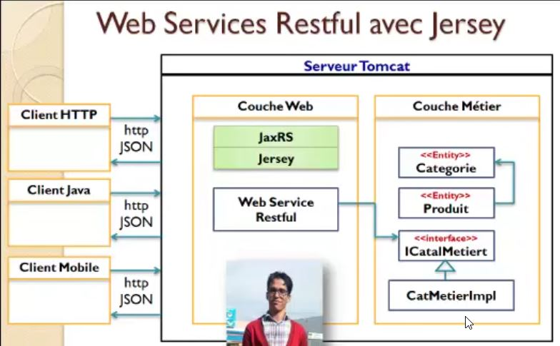


# Creation et conversion du projet

Creation d'un projet web dynamic et le convertir en un projet maven


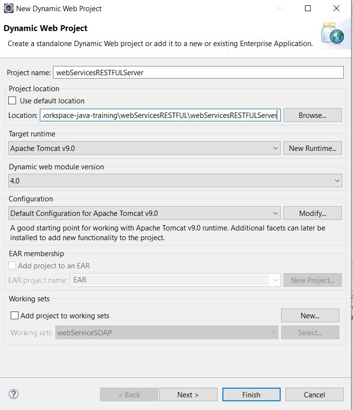

Convertir le projet en un projet maven. Ceci rendra plus facilement la gestion automatisée des jar.

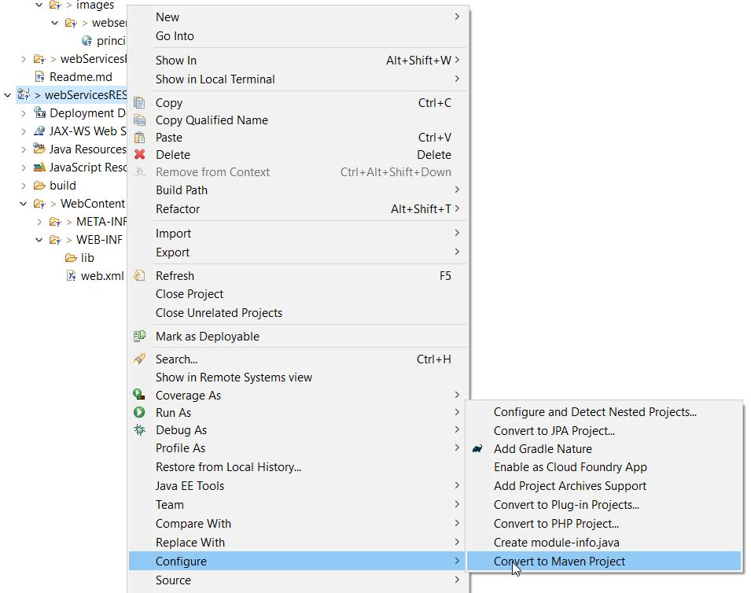

Ajouter les dépendances suivantes au fichier pom.xml


```xml
 
	<dependencies>
		<dependency>
			<groupId>asm</groupId>
			<artifactId>asm</artifactId>
			<version>3.3.1</version>
		</dependency>
		<dependency>
			<groupId>com.sun.jersey</groupId>
			<artifactId>jersey-bundle</artifactId>
			<version>1.19.4</version>
		</dependency>
		<dependency>
			<groupId>com.sun.jersey</groupId>
			<artifactId>jersey-server</artifactId>
			<version>1.19.4</version>
		</dependency>
		<dependency>
			<groupId>com.sun.jersey</groupId>
			<artifactId>jersey-core</artifactId>
			<version>1.19.4</version>
		</dependency>
		<dependency>
			<groupId>com.sun.jersey</groupId>
			<artifactId>jersey-json</artifactId>
			<version>1.19.4</version>
		</dependency>
		<dependency>
			<groupId>org.springframework</groupId>
			<artifactId>spring-core</artifactId>
			<version>5.1.8.RELEASE</version>
		</dependency>
		<dependency>
			<groupId>org.springframework</groupId>
			<artifactId>spring-context</artifactId>
			<version>5.1.8.RELEASE</version>
		</dependency>
		<dependency>
			<groupId>org.springframework</groupId>
			<artifactId>spring-context-support</artifactId>
			<version>5.1.8.RELEASE</version>
		</dependency>
		<dependency>
			<groupId>org.springframework</groupId>
			<artifactId>spring-beans</artifactId>
			<version>5.1.8.RELEASE</version>
		</dependency>
	</dependencies>
	  
```


## Configuration tomcat
configurer **tomcat** pour hoster l'application.

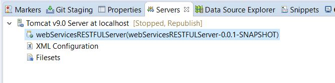


## Ajouter la section suivante au fichier web.xml


La section **init-param  <param-name>com.sun.jersey.config.property.packages</param-name>** indique où se trouve les services à exposer. Tous les services doivent donc se trouver dans le package java indiqué ( ici pour exemple c'est **service** )


- Si l'on souhaite manipuler un content Type Json **@MediaType.APPLICATION_JSON** il faudra alors prévoir d'ajouter la section  **<param-name>com.sun.jersey.api.json.POJOMappingFeature</param-name>**  et d'ajouter la section **jersey-json** Dependency dans le fichier maven.

- Si l'on souhaite manipuler un content Type xml **MediaType.APPLICATION_XML** il faudra alors d'annoter toutes les entités avec **@XmlRootElement**


Au démarrage tomcat va lire le fichier **web.xml** et rechercher les webservices dans le package spécifiés ( ici pour exemple **service** ou sont stockés nos services) 


```xml
<?xml version="1.0" encoding="UTF-8"?>
<web-app xmlns:xsi="http://www.w3.org/2001/XMLSchema-instance"
	xmlns="http://xmlns.jcp.org/xml/ns/javaee"
	xsi:schemaLocation="http://xmlns.jcp.org/xml/ns/javaee http://xmlns.jcp.org/xml/ns/javaee/web-app_4_0.xsd"
	id="WebApp_ID" version="4.0">
	<display-name>webServicesRESTFULServer</display-name>
	<welcome-file-list>
		<welcome-file>index.html</welcome-file>
		<welcome-file>index.htm</welcome-file>
		<welcome-file>index.jsp</welcome-file>
		<welcome-file>default.html</welcome-file>
		<welcome-file>default.htm</welcome-file>
		<welcome-file>default.jsp</welcome-file>
	</welcome-file-list>


	<!--Jersey Servlet configurations -->
	<servlet>
		<servlet-name>Jersey REST Service</servlet-name>
		<servlet-class>com.sun.jersey.spi.container.servlet.ServletContainer</servlet-class>
		<init-param>
			<param-name>com.sun.jersey.config.property.packages</param-name>
			<param-value>service</param-value>
		</init-param>
		<init-param>
			<param-name>com.sun.jersey.api.json.POJOMappingFeature</param-name>
			<param-value>true</param-value>
		</init-param>
		<load-on-startup>1</load-on-startup>
	</servlet>
	<servlet-mapping>
		<servlet-name>Jersey REST Service</servlet-name>
		<url-pattern>/*</url-pattern>
	</servlet-mapping>
	<!--Jersey Servlet configurations -->


</web-app>
```


## Entités


l'annotation **jackon** ( pour le json ) dans les **entités** java ( ici Compte ) renconnait l'annotation JAXB (xml). On pourrait enlever cette annotation.

###  Entity Categorie
```java
package metier.entities;

import java.io.Serializable;

public class Categorie implements Serializable {

	private Long idCategorie;
	private String nomCategorie;
	private String photo;

	public Long getIdCategorie() {
		return idCategorie;
	}

	public void setIdCategorie(Long idCategorie) {
		this.idCategorie = idCategorie;
	}

	public String getNomCategorie() {
		return nomCategorie;
	}

	public void setNomCategorie(String nomCategorie) {
		this.nomCategorie = nomCategorie;
	}

	public String getPhoto() {
		return photo;
	}

	public void setPhoto(String photo) {
		this.photo = photo;
	}

	public Categorie(Long idCategorie, String nomCategorie, String photo) {
		super();
		this.idCategorie = idCategorie;
		this.nomCategorie = nomCategorie;
		this.photo = photo;
	}

	public Categorie() {
		super();
	}

}

```


###  Entity Produit
```java
package metier.entities;

import java.io.Serializable;

import org.codehaus.jackson.annotate.JsonIgnore;
import org.codehaus.jackson.annotate.JsonSetter;

public class Produit implements Serializable {

	private Long idProduit;
	private String designation;
	private double prix;
	private String photo;
	private Categorie categorie;

	public Produit() {
		super();
	}

	public Produit(Long idProduit, String designation, double prix, String photo, Categorie categorie) {
		super();
		this.idProduit = idProduit;
		this.designation = designation;
		this.prix = prix;
		this.photo = photo;
		this.categorie = categorie;
	}

	public Long getIdProduit() {
		return idProduit;
	}

	public void setIdProduit(Long idProduit) {
		this.idProduit = idProduit;
	}

	public String getDesignation() {
		return designation;
	}

	public void setDesignation(String designation) {
		this.designation = designation;
	}

	public double getPrix() {
		return prix;
	}

	public void setPrix(double prix) {
		this.prix = prix;
	}

	public String getPhoto() {
		return photo;
	}

	public void setPhoto(String photo) {
		this.photo = photo;
	}

	@JsonIgnore // Ne retourne pas la categorie lors de la requet clients (post, get, put .... )
	public Categorie getCategorie() {
		return categorie;
	}

	@JsonSetter // Autorise les mise à jours clients (post,put,delete)
	public void setCategorie(Categorie categorie) {
		this.categorie = categorie;
	}

}

```


## Creation de l'inteface metier et son implementation.

### interface ICatalogMetier
```java
package metier;

import java.util.List;

import metier.entities.Categorie;
import metier.entities.Produit;

public interface ICatalogMetier {

	public Categorie addCategorie(Categorie categorie);

	public Produit addProduit(Produit produit);

	public List<Categorie> listCategories();

	public List<Produit> listProduits();

	public List<Produit> produitsParCategorie(Long idCategorie);

	public List<Produit> produitsParMotCle(String motCle);

	public Categorie updateCategorie(Categorie categorie);

	public Produit updateProduit(Produit produit);

	public boolean deleteProduit(Long idProduit);

	public Categorie getCategorie(Long idCat);

	public Produit getProduit(Long idProd);

	public void initialiserCatalogue();

}
```

### Implementation CatalogueMetierImplement

```java
package metier;

import java.util.ArrayList;
import java.util.HashMap;
import java.util.List;
import java.util.Map;

import metier.entities.Categorie;
import metier.entities.Produit;

public class CatalogueMetierImplement implements ICatalogMetier {

	
	private Map<Long, Categorie> categories = new HashMap<Long, Categorie>();
	private Map<Long, Produit> produits = new HashMap<Long, Produit>();

	
	@Override
	public Categorie addCategorie(Categorie categorie) {
		categories.put(categorie.getIdCategorie(), categorie);
		return categorie;
	}

	@Override
	public Produit addProduit(Produit produit) {
		produit.setCategorie(getCategorie(produit.getCategorie().getIdCategorie()));
		produits.put(produit.getIdProduit(), produit);
		return produit;
	}

	@Override
	public List<Categorie> listCategories() {
		return new ArrayList<Categorie>(categories.values());
	}

	@Override
	public List<Produit> produitsParCategorie(Long idCategorie) {
		List<Produit> prods = new ArrayList<Produit>();

		for (Produit p : produits.values()) {
			if (p.getCategorie().getIdCategorie().equals(idCategorie)) {

				prods.add(p);

			}
		}
		return prods;

	}

	@Override
	public List<Produit> listProduits() {
		return new ArrayList<Produit>(produits.values());

	}

	@Override
	public List<Produit> produitsParMotCle(String motCle) {
		List<Produit> prods = new ArrayList<Produit>();

		for (Produit p : produits.values()) {
			if (p.getDesignation().contains(motCle)) {
				prods.add(p);

			}
		}
		return prods;

	}

	@Override
	public Categorie updateCategorie(Categorie categorie) {

		categories.put(categorie.getIdCategorie(), categorie);
		return categorie;
	}

	@Override
	public Produit updateProduit(Produit produit) {
		produits.put(produit.getIdProduit(), produit);
		return produit;
	}

	@Override
	public boolean deleteProduit(Long idProduit) {

		if (produits.get(idProduit) != null) {
			produits.remove(idProduit);
			return true;
		} else
			throw new RuntimeException("Produit introuvable");
	}

	@Override
	public Categorie getCategorie(Long idCat) {
		return categories.get(idCat);
	}

	@Override
	public Produit getProduit(Long idProd) {
		return produits.get(idProd);
	}

	// Alimenter les list categories et produits pour des besoins de test.
	public void initialiserCatalogue() {
		addCategorie(new Categorie(1L, "Ordinateur", "ordinateur.jpg"));
		addCategorie(new Categorie(2L, "Imprimante", "imprimante.jpg"));
		addCategorie(new Categorie(3L, "Télévisieur", "téléviseur.jpg"));

		addProduit(new Produit(1L, "HP parvions 17-f227n pc ", 6500, "ord1.jpg", getCategorie(1L)));
		addProduit(new Produit(2L, "Asus pc portable reconditionné", 4500, "ord2.jpg", getCategorie(1L)));
		addProduit(new Produit(3L, "Lenovo notebook ", 3500, "ord2.jpg", getCategorie(1L)));
		addProduit(new Produit(4L, "HP Imprimante laser laserjet ", 1500, "imp1.jpg", getCategorie(2L)));
		addProduit(new Produit(5L, "Canon Imprimante prixma ", 1000, "imp2.jpg", getCategorie(2L)));
		addProduit(new Produit(6L, "Tomson TV", 6000, "tv1.jpg", getCategorie(3L)));

		System.out.println(
				"-------------------------------------------------------------------------------------------------");
		for (Produit p : this.listProduits()) {
			System.out.println("produit: " + p.getIdProduit() + " designation :" + p.getDesignation() + " categorieID: "
					+ p.getCategorie().getIdCategorie());
		}
		System.out.println(
				"-------------------------------------------------------------------------------------------------");

	}

}

```


## Creation d'un Service Restful

Creer une classe et la stockée dans le package java **service** conformément au fichier **web.xml**. On peut bien entendu changer le package , il faudra alors le faire aussi dans le fichier **web.xml**. Il y a une Injection of Control sur l'objet 

### Service Restful
```java
package service;

import java.util.List;

import javax.ws.rs.Consumes;
import javax.ws.rs.DELETE;
import javax.ws.rs.FormParam;
import javax.ws.rs.GET;
import javax.ws.rs.POST;
import javax.ws.rs.PUT;
import javax.ws.rs.Path;
import javax.ws.rs.PathParam;
import javax.ws.rs.Produces;
import javax.ws.rs.QueryParam;
import javax.ws.rs.core.MediaType;

import metier.ICatalogMetier;
import metier.entities.Categorie;
import metier.entities.Produit;

import org.springframework.beans.factory.BeanFactory;
import org.springframework.beans.factory.xml.XmlBeanFactory;
import org.springframework.context.support.ClassPathXmlApplicationContext;
import org.springframework.core.io.ClassPathResource;
import org.springframework.core.io.Resource;

import com.sun.jersey.spi.container.ParamQualifier;
import com.sun.jersey.spi.resource.Singleton;

@Singleton // demande à JERSEY de ne creer qu'une seul instance du web service pour toutes
			// les requetes des clients. post,get,put ...
@Produces(MediaType.APPLICATION_JSON + "; charset=utf8") // support "é,ê,è .."
@Path("/catalogue")
public class CatalogueService {


	ClassPathXmlApplicationContext context = new ClassPathXmlApplicationContext(
			new String[] { "applicationContext.xml" });

	private ICatalogMetier metier;

	public CatalogueService() {
		metier = (ICatalogMetier) context.getBean("catalogueMetier");
		metier.initialiserCatalogue();
	}

	@GET
	@Path("/categories")
	public List<Categorie> consulterCategories() {
		return metier.listCategories();
	}

	// @pathParam =
	// http://localhost:8080/webServicesRESTFULServer1/catalogue/categories/1/produits
	// chercher les produits d'un produit donné
	@GET
	@Path("/categories/{idCateg}/produits")
	public List<Produit> produitsParCategorie(@PathParam(value = "idCateg") Long idCategorie) {
		return metier.produitsParCategorie(idCategorie);
	}

	// @QueryParam =
	// http://localhost:8080/webServicesRESTFULServer1/catalogue/produits?keyWord=HP
	// chercher les produits par mot clé
	@GET
	@Path("/produits")
	public List<Produit> produitsParMotCle(@QueryParam(value = "keyWord") String motCle) {
		return metier.produitsParMotCle(motCle);
	}

	// @QueryParam =
	// http://localhost:8080/webServicesRESTFULServer1/catalogue/produits?keyWord=HP
	// chercher les produits par mot clé
	@GET
	@Path("/allproduits")
	public List<Produit> getProduits() {
		return metier.listProduits();
	}

	// @@PathParam
	// =http://localhost:8080/webServicesRESTFULServer1/catalogue/produits/1
	// chercher une categorie suivant id
	@GET
	@Path("/categories/{idCateg}")
	public Categorie getCategorie(@PathParam(value = "idCateg") Long idCategorie) {
		return metier.getCategorie(idCategorie);
	}

	// @PathParam
	// =http://localhost:8080/webServicesRESTFULServer1/catalogue/produits/1
	@GET
	@Path("/produits/{idProd}")
	public Produit getProduit(@PathParam(value = "idProd") Long idProduit) {
		return metier.getProduit(idProduit);
	}

	@POST
	@Path("/categories")
	@Consumes(MediaType.APPLICATION_JSON) // le client doit envoyer en json
	public Categorie saveCategorie(Categorie categorie) {
		return metier.addCategorie(categorie);
	}

	@POST
	@Path("/produits")
	@Consumes(MediaType.APPLICATION_JSON) // le client doit envoyer en json
	public Produit saveProduit(Produit produit) {
		return metier.addProduit(produit);
	}

	// @FormParam = envoyer dans le "body" de la requet sous content-type :
	// application/x-www-from-unlencoded
	@DELETE
	@Path("/produits")
	@Consumes(MediaType.APPLICATION_FORM_URLENCODED) // le client doit envoyer en json
	public boolean deleteProduit(@FormParam(value = "idProd") Long idProduit) {
		return metier.deleteProduit(idProduit);
	}

	@PUT
	@Path("/produits")
	public Produit updateProduit(Produit produit) {
		return metier.updateProduit(produit);
	}

}
```


### Injection of controle configuration

```xml
<?xml version="1.0" encoding="UTF-8"?>
<beans xmlns="http://www.springframework.org/schema/beans"
	xmlns:xsi="http://www.w3.org/2001/XMLSchema-instance"
	xsi:schemaLocation="
        http://www.springframework.org/schema/beans http://www.springframework.org/schema/beans/spring-beans.xsd">

	<bean id="catalogueMetier" class="metier.CatalogueMetierImplement"></bean>

</beans>
```


## MediaType

l'attribut **Accept** dans le header permet de signifier au serveur distant que l'on voudrait recevoir les données sous un format particulier , xml, jason, text ....
On peut demander à **postman** quel sera le format du retour accepté **Accept** et le format d'envoi **media-content**.
  

Recevoir au format xml et envoyer au format json ( Exemple)

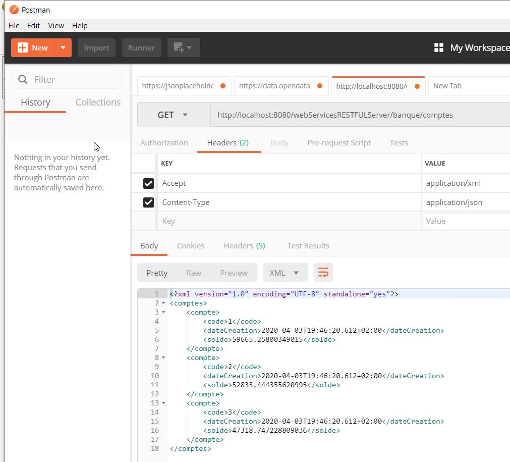


## Test les endpoints

### GET all Produits
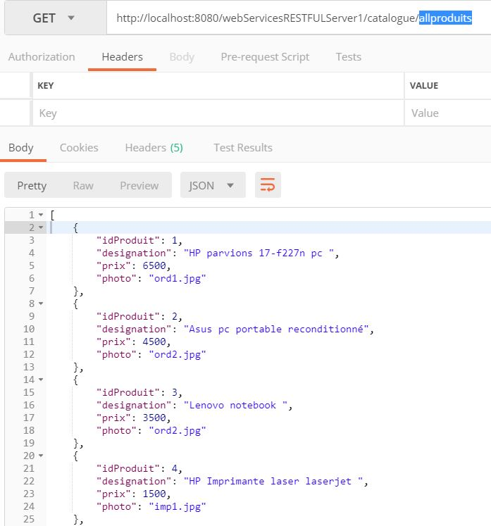

### GET All Categorie

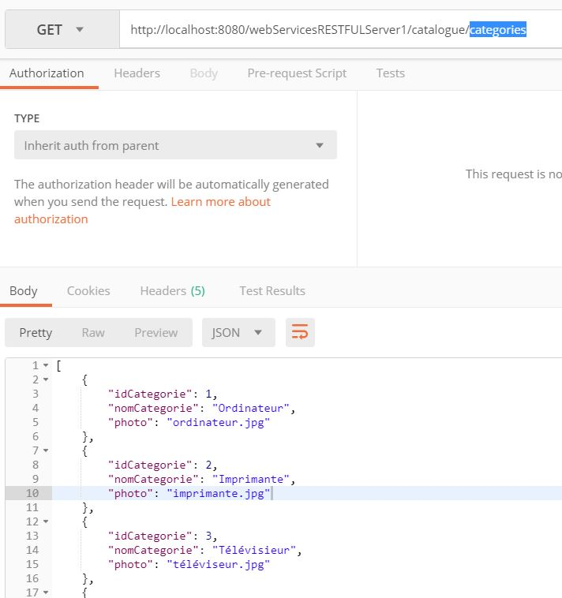

### GET tous les produits d'une Categorie

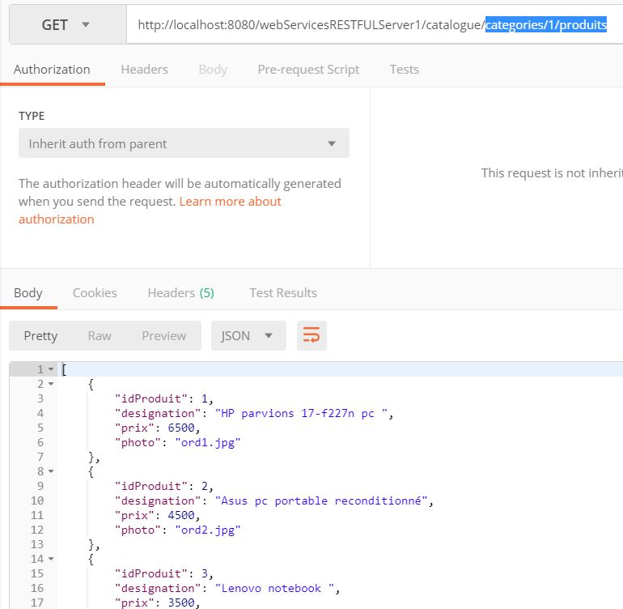

## POST Ajouter un produit
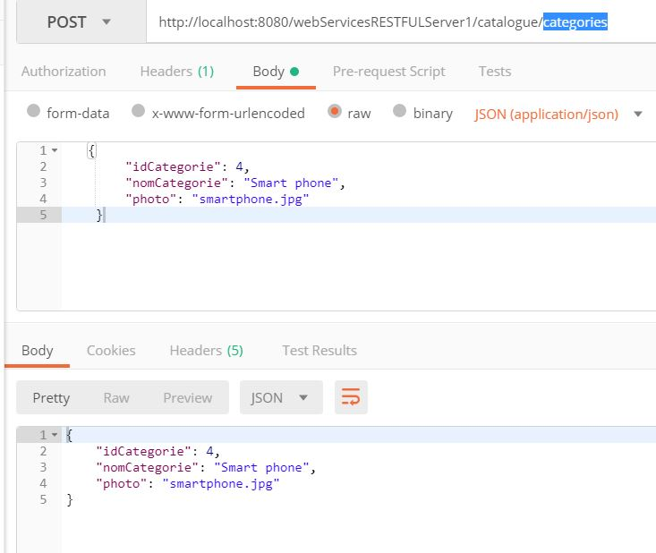

## PUT Mise d'un produit
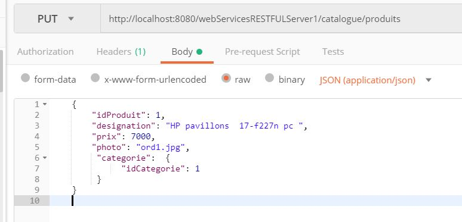

## DELETE Suppresssion d'un produit
ici nous avons defini le media-type à **x-www-form-urlencoded**.  Il faut défini une **key=value** dans le corps de la request **Delete**
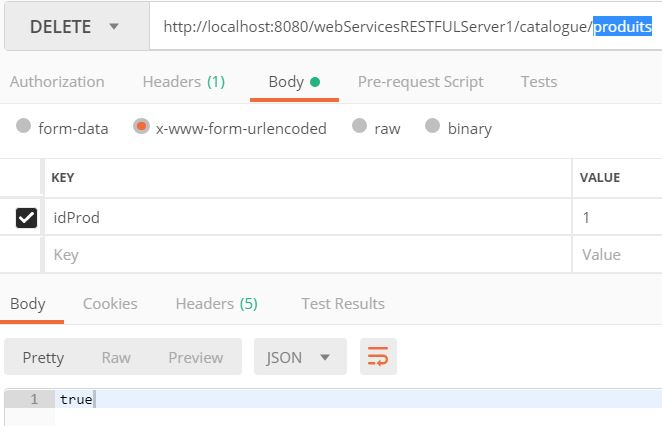

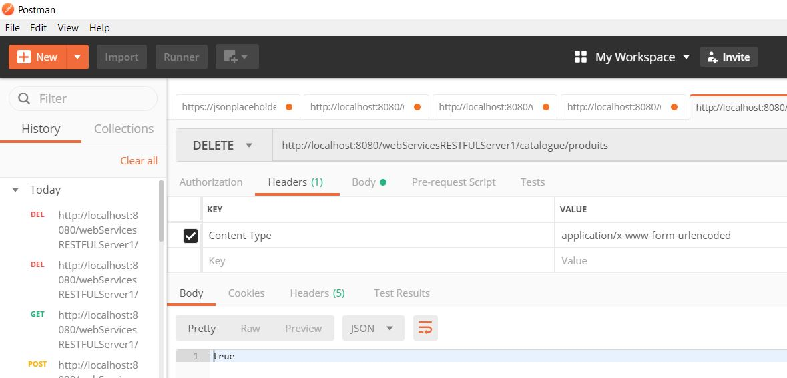


## WADL

### Apercu du service RESTful 


**GET http://localhost:8080/webServicesRESTFULServer1/application.wadl**

```xml
<?xml version="1.0" encoding="UTF-8" standalone="yes"?>
<application xmlns="http://wadl.dev.java.net/2009/02">
    <doc xmlns:jersey="http://jersey.java.net/" jersey:generatedBy="Jersey: 1.19.4 05/24/2017 03:46 PM"/>
    <grammars/>
    <resources base="http://localhost:8080/webServicesRESTFULServer1/">
        <resource path="/catalogue">
            <resource path="/produits">
                <method id="deleteProduit" name="DELETE">
                    <request>
                        <representation mediaType="application/x-www-form-urlencoded">
                            <param xmlns:xs="http://www.w3.org/2001/XMLSchema" name="idProd" style="query" type="xs:long"/>
                        </representation>
                    </request>
                    <response>
                        <representation mediaType="application/json; charset=utf8"/>
                    </response>
                </method>
                <method id="saveProduit" name="POST">
                    <request>
                        <representation mediaType="application/json"/>
                    </request>
                    <response>
                        <representation mediaType="application/json; charset=utf8"/>
                    </response>
                </method>
                <method id="updateProduit" name="PUT">
                    <request>
                        <representation mediaType="*/*"/>
                    </request>
                    <response>
                        <representation mediaType="application/json; charset=utf8"/>
                    </response>
                </method>
                <method id="produitsParMotCle" name="GET">
                    <request>
                        <param xmlns:xs="http://www.w3.org/2001/XMLSchema" name="keyWord" style="query" type="xs:string"/>
                    </request>
                    <response>
                        <representation mediaType="application/json; charset=utf8"/>
                    </response>
                </method>
            </resource>
            <resource path="/allproduits">
                <method id="getProduits" name="GET">
                    <response>
                        <representation mediaType="application/json; charset=utf8"/>
                    </response>
                </method>
            </resource>
            <resource path="/categories/{idCateg}">
                <param xmlns:xs="http://www.w3.org/2001/XMLSchema" name="idCateg" style="template" type="xs:long"/>
                <method id="getCategorie" name="GET">
                    <response>
                        <representation mediaType="application/json; charset=utf8"/>
                    </response>
                </method>
            </resource>
            <resource path="/produits/{idProd}">
                <param xmlns:xs="http://www.w3.org/2001/XMLSchema" name="idProd" style="template" type="xs:long"/>
                <method id="getProduit" name="GET">
                    <response>
                        <representation mediaType="application/json; charset=utf8"/>
                    </response>
                </method>
            </resource>
            <resource path="/categories">
                <method id="saveCategorie" name="POST">
                    <request>
                        <representation mediaType="application/json"/>
                    </request>
                    <response>
                        <representation mediaType="application/json; charset=utf8"/>
                    </response>
                </method>
                <method id="consulterCategories" name="GET">
                    <response>
                        <representation mediaType="application/json; charset=utf8"/>
                    </response>
                </method>
            </resource>
            <resource path="/categories/{idCateg}/produits">
                <param xmlns:xs="http://www.w3.org/2001/XMLSchema" name="idCateg" style="template" type="xs:long"/>
                <method id="produitsParCategorie" name="GET">
                    <response>
                        <representation mediaType="application/json; charset=utf8"/>
                    </response>
                </method>
            </resource>
        </resource>
    </resources>
</application>
```

